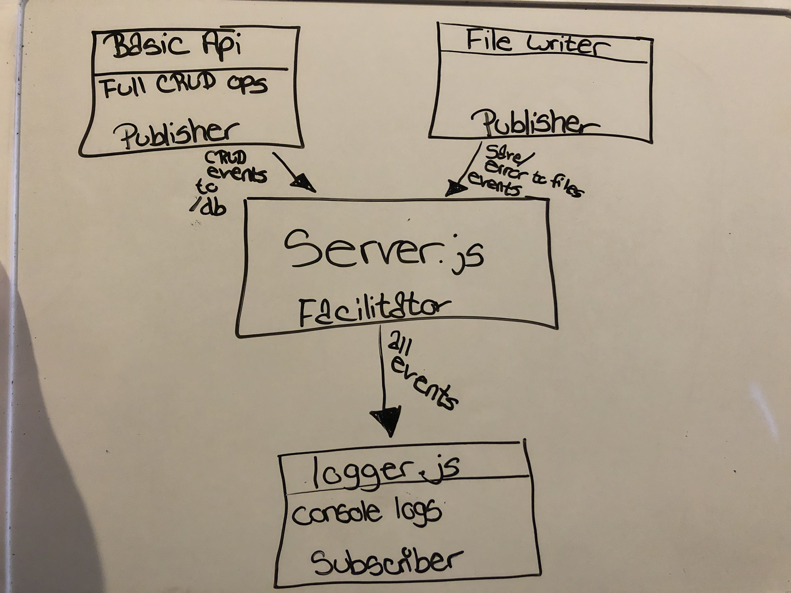

# LAB - 19

## Project Name
Message Queue Server and Logger

### Author: Tia Rose

### Links and Resources
* [submission PR](https://github.com/tia-rose-401-advanced-javascript/Lab-19-logger/pull/1)
* [travis](https://www.travis-ci.com/tia-rose-401-advanced-javascript/Lab-19-logger)

### Modules
#### `logger.js`
##### Exported Values and Methods

### Setup
#### `.env` requirements
* `PORT` - 3030

#### Running the app
* `npm start` or node logger.js
  
#### Tests
* How do you run tests?

npm run test

* What assertions were made?
* What assertions need to be / should be made?

#### UML
